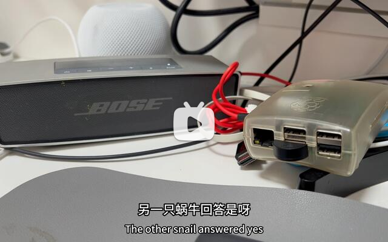

# ChatGPT语音助手
[](https://github.com/jackwuwei/gptspeaker/blob/main/README.md)
* 这是一个关于ChatGPT语音助手的项目，它使用树莓派（或桌面操作系统）来实现与OpenAI大型语言模型的进行语音对话。完整实现了实现了语音唤醒，语音转文本，再通过OpenAI GPT处理对话，并将文本合成为语音。就像Apple Siri，Amazon Alex，Google Nest Home，小米小爱那样。

* 该项目用Python编写，支持Linux/Raspbian，macOS和Windows。

# 功能

- 支持实时语音对话。在ChatGPT返回一句话后，你可以听到声音，而不是等待所有ChatGPT回复之后才开始语音合成。
- 支持连续对话，保存所有ChatGPT当前对话的历史。当ChatGPT对话大于4096个令牌（gpt-3.5-turbo）时，早期对话历史将被丢弃。
- 支持本地识别唤醒词，就像Siri一样使用。

# 语音助手扬声器

[](https://www.bilibili.com/video/BV1Wo4y1K7dW/)
> 点击上面的图片播放👆

- 硬件成本
  - 购买[Raspberry PI 3/3B/4/4B](https://www.raspberrypi.com/products/)
  - 购买[USB Micro Phone](https://item.taobao.com/item.htm?spm=a230r.1.14.23.315b64e0hmblId&id=668895270969&ns=1&abbucket=1#detail)
  - 购买带3.5mm音频口的音箱
  - SD卡（>= 8GB）（设置树莓派OS）

- 软件成本
  - [Azure Cognitive Speech Services](https://aka.ms/friendbot/azurecog)
     - **免费层**：每月5个音频小时和1个并发请求。
     - **免费$200美元额度**：新Azure账户在前30天内可以使用。
  - [OpenAI](https://aka.ms/maker/openai/pricing)
     - **$0.002 / 1K tokens / ~750 words**：ChatGPT（gpt-3.5-turbo）
     - **免费$18美元额度**：新OpenAI账户在前90天内可以使用。

# 设置

- 你需要一个Azure Cognitive Services实例和一个OpenAI账户。你可以在几乎任何平台上运行软件，但让我们从树莓派开始。

## 树莓派

- 如果你是树莓派的新手，可以查看这个[入门](https://www.raspberrypi.com/documentation/computers/getting-started.html)指南。

### 1. 操作系统

1. 将SD卡插入你的PC。
1. 访问[树莓派网站](https://www.raspberrypi.com/software/)，然后下载并运行Raspberry Pi Imager。
1. 点击`Choose OS`并选择Raspberry Pi OS (64-bit)或Ubuntu 22.04.2 LTS (64-bit)。
1. 点击`Choose Storage`，选择SD卡。
1. 点击`Write`并等待镜像完成

1. 将SD卡放入你的树莓派并连接键盘，鼠标和显示器。
1. 完成初始设置，确保配置了Wi-Fi。

### 2. USB扬声器/麦克风

1. 如果你还没有插入USB扬声器/麦克风，请插入。
1. 在树莓派OS桌面上，右键点击屏幕右上角的音量图标，确保选择了USB设备。
1. 右键点击屏幕右上角的麦克风图标，确保选择了USB设备。

## Azure

* 本项目使用Azure Cognitive Service进行语音转文本和文本转语音。以下是创建Azure账户和Azure Cognitive Services实例的步骤。

### 1. Azure账户

1. 在网络浏览器中，访问[这里](https://aka.ms/friendbot/azure)，点击`Try Azure for Free`。
1. 点击`Start Free`开始创建一个免费的Azure账户。
1. 使用你的Microsoft或GitHub账户登录。
1. 登录后，你将被提示输入一些信息。
   > 注意：即使这是一个免费账户，Azure仍然需要信用卡信息。除非你以后更改设置，否则你不会被收费。
1. 在你的账户设置完成后，访问[这里](https://aka.ms/friendbot/azureportal)。

### 2. Azure Cognitive Services

1. 在[这个地址](https://aka.ms/friendbot/azureportal) 登录你的账户。
1. 在顶部的搜索栏中输入`Cognitive Services`。在`Marketplace`下选择`Cognitive Services`。（可能需要几秒钟才能显示。）
1. 确认选择了正确的订阅。在`Resource Group`下选择`Create New`。输入一个资源组名称（例如`conv-speak-rg`）。
1. 选择一个区域和你的Azure Cognitive Services实例的名称（例如`my-conv-speak-cog-001`）。
   > 注意：建议选择EastAsia或SoutheastAsia，因为这些区域在中国访问比较快。
1. 点击`Review + Create`。验证通过后，点击`Create`。
1. 部署完成后，你可以点击`Go to resource`查看你的Azure Cognitive Services资源。
1. 在左侧导航栏中，选择`Resourse Management`下的`Keys and Endpoint`。
1. 复制两个Cognitive Services密钥中的任何一个。将这个密钥保存在一个安全的地方以备后用。
   > Windows 11用户：如果应用程序在调用文本转语音API时停滞不前，请确保你已经应用了所有当前的安全更新（[链接](https://learn.microsoft.com/en-us/windows/release-health/resolved-issues-windows-11-22h2#2924msgdesc)）。

## OpenAI

* 本项目使用OpenAI的GPT模型进行智能对话。以下是创建新账户和访问AI模型的步骤。支持OpenAI官方API或者Azure OpenAI API，二选一即可。

### 1. OpenAI账户

1. 在网络浏览器中，访问(这里)[https://aka.ms/maker/openai]。点击`Sign up`。
   > 注意：可以使用Google账户，Microsoft账户或电子邮件创建新账户。
1. 完成注册过程（例如，创建密码，验证你的电子邮件等）。
   > 注意：如果你是OpenAI的新用户，请查看[使用指南](https://beta.openai.com/docs/usage-guidelines)。
1. 在右上角点击你的账户。点击`View API keys`。
1. 点击`+ Create new secret key`。复制生成的密钥并将其保存在一个安全的地方以备后用。
   _如果你想直接体验大型语言模型，可以在登录[这里](https://aka.ms/maker/openai) 后在[页面顶部查看] (https://platform.openai.com/playground?mode=chat)。_

### 2. Azure OpenAI账号
> OpenAI官方账号和Azure OpenAI账号二选一
1. 创建Azure账户 (Create an Azure Account)
   * 如果还没有Azure账户，请先前往[Azure官方网站](https://azure.microsoft.com/zh-cn/free/)注册一个账户。Azure提供免费账户选项，新用户可以获得一定的免费额度用于测试和学习。
1. 申请访问权限 (Apply for Access)
   * 在[Azure OpenAI服务页面](https://aka.ms/oai/access)，点击“申请访问权限”按钮。这将引导你到申请页面，在这里你需要填写一些必要的信息，包括公司名称、使用案例等。
   * 提交申请 (Submit the Application),填写完申请表单后，点击提交。Azure团队会对你的申请进行审核，审核通过后会发送电子邮件通知你。
1. 配置和使用 (Configure and Use)
   * 一旦获得访问权限，你可以在Azure门户中创建一个新的OpenAI服务资源。创建完成后，你可以获取API密钥，并根据官方文档开始使用Azure OpenAI服务。
# 代码

## 1. 代码配置

1. Python Speech SDK包适用于Windows（x64和x86），Mac x64（macOS X版本10.14或更高），Mac arm64（macOS版本11.0或更高），和Linux
1. 在树莓派或你的PC上，打开一个命令行终端。
1. 在Ubuntu或Debian上，运行以下命令安装所需的包：
   ```sh
   sudo apt-get update
   sudo apt-get install libssl-dev libasound2
   ```
1. 在**Ubuntu 22.04 LTS**上，还需要下载并安装最新的**libssl1.1**包，例如从[这里](http://security.ubuntu.com/ubuntu/pool/main/o/openssl/)。
1. 克隆仓库。
   ```bash
   git clone https://github.com/jackwuwei/gptspeaker.git
   ```
1. 设置你的API密钥：将config.json中的`{AzureCognitiveServices.Key}`和`{AzureCognitiveServices.Region}`替换为你的OpenAI API密钥，将`{OpenAI.Key}`替换为你的OpenAI API密钥。
   ```json
   {
      "AzureCognitiveServices": 
      {
         "Key": "AzureCognitiveServicesKey", 
         "Region": "AzureCognitiveServicesRegion",
      },
      "OpenAI": 
      {
         "Key": "OpenAIKey", 
      },
      // 与上面的OpenAI二选一即可
      "AzureOpenAI": 
      {
         "Key": "", // 密钥 1 或者 密钥 2
         "api_version": "2024-02-01",
         "Endpoint": "", // 终结点
         "Model": "" // Azure AI Studio的部署名
     }
   }
   ```
1. 安装依赖库
    ```bash
    pip3 -r install requirements.txt
    ```
1. 运行代码！
   ```bash
   python3 gptspeaker.py
   ```

## 2. （可选）创建自定义唤醒短语

* 代码库已经有一个默认的唤醒短语（`"Hey GPT"`），我建议你首先使用。如果你想创建你自己的（免费的！）自定义唤醒词，那么请按照以下步骤操作。

1. 使用这里的指导创建一个自定义关键词模型：[链接](https://aka.ms/hackster/microsoft/wakeword)。
1. 下载模型，提取`.table`文件并将其复制到源根目录。
1. 更新`config.json`文件，将你的唤醒词文件包含在构建中。
   ```json
   "AzureCognitiveServices": {
   "WakePhraseModel": "xxx.table",
   "WakeWord": "xxx",
   }
   ```
1. 重新运行代码以使用你的自定义唤醒词。
